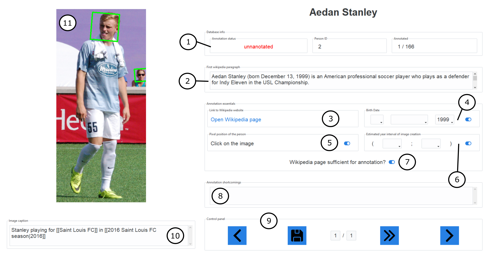
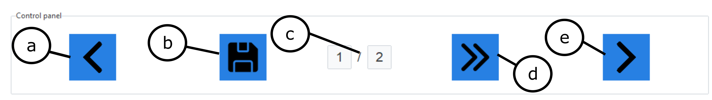

## Annotation procedure

### Annotation tool layout

1) Database info - contains the current status of the annotation (annotated/partially annotated/fully annotated), person ID within the database and an information about the progress with respect to the current dataset.

2) First wikipedia paragraph - Preview of the first paragraph from the wikipedia page. 

3) Link to wikipedia website - Opens the wikipedia website for the person. 

4) Birth date - Box for entering the birth date data for the person. The blue toggle button should be unmarked if the birth date info is impossible to gather.

5) Pixel position of the person - The annotator should mark the correct bounding box in the photo (11) corresponding to the annotated person by clicking inside the correct green rectangle.  
If there is only one bounding box detected it is selected automatically and no action is required. If there is no green rectangles in the picture (11) or there are multiple, the annotator should pick the correct one by clicking on the nose of the annotated person. The inside of the rectangle turns green and red dot indicating the nose of the person appears. If there is no bounding box, only the red dot will appear.

6) Estimated year interval of image creation - Box for entering the estimated time of image creation. If the estimation is not possible, the blue toggle button should be unmarked.
 The annotator can fill one year (i.e. in the example shown in the picture - 2016 gathered from the caption (10)) or a range of years (i.e. when the caption says "Winston Churchill during the time of the Boer wars.")

7) This blue toggle button should be unmarked if external sources other than the wikipedia page were used for gathering the data. 
**NOTE: Plain wikipedia page, the annotator is only allowed to click the link in (3) and scroll on the page that opens. NO FURTHER CLICKING IS ALLOWED.** 
If the data were gathered from elsewhere, this checkbox must be unmarked.

8) Annotation shortcommings - If the annotator failed to gather any data, the shortcommings should be described in this textbox.

9) Control panel
   

   c) Lists the total number of photos for current person 
   Click to:  
   a) Go back to the previous annotation 
   b) Save current annotation 
   d) Skips to the next unanotated person  
   e) Goes to the next person according to the order of the database  

10) Image caption - caption extracted from the wikipedia page.

11) Image - The face or bounding box should be marked by clicking as described in point (5).

### Annotation process step-by-step guide

1) Look at the first paragraph of the wikipedia page - box (2), if there is a birth date, fill it in the box (4) - the date format should be (dd - mm - yyyy), all integers.

2) Look at the Image caption - box (10), if you can guess the year or range of years in which the photo was taken fill it in the box (6).

3) Pick the correct bounding box in the picture (11). If there is only one person in the picture with face marked by a green rectangle, which has a green filling, nothing needs to be done. Otherwise, click in the correct rectangle. You should click on the nose of the person being annotated.

4) If all the information about the person was successfully filled in, click the (b) button in control panel (9). The annotation is complete. The text in box (1) should change to "fully annotated". You can continue with the next annotation by clicking (e) button in the control panel (9).

5) If not click on the link inside the box (3) - Open wikipedia page. Try to deduce the birth date and year range in which the photo was taken from the wikipedia page which opens. **YOU ARE ONLY ALLOWED TO SCROLL ON THIS PAGE, NO CLICKING IS ALLOWED**. If you find the information you are looking for fill it in the boxes (4) and (6).

6) If you were not able to find information on the wikipedia page that opens from link (3), you may search for information elsewhere. **HOWEVER IF YOU DO UNMARK THE BLUE TOGGLE BUTTON IN (7)**.

8) Fill in all the necessary information, if possible. Unmark the blue toggle buttons in the boxes (4), (5) and (6) if the information in the specific box is unobtainable.

9) If there is any information missing note it in the textbox (8) - annotation shortcommings.

10) Click the (b) button in control panel (9). The annotation is complete. The text in box (1) should change to "fully annotated". You can continue with the next annotation by clicking (e) button in the control panel (9).
